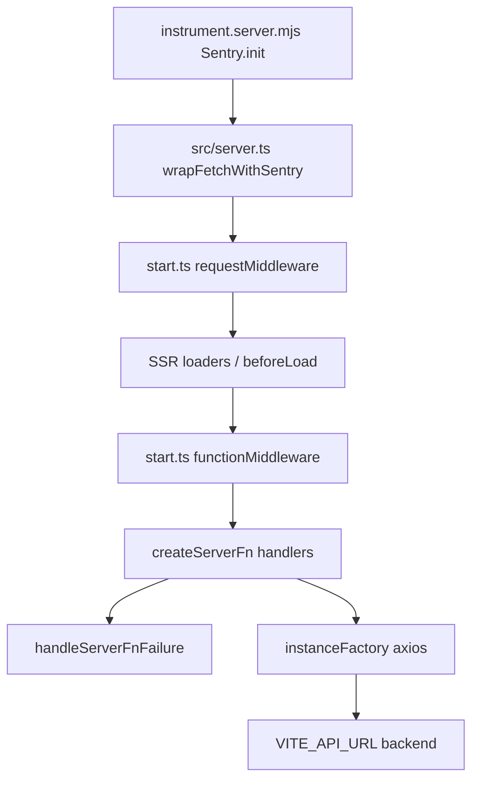

# Replace Sentry with Azure Monitor (server-only OTel)

## Current state (inspected)

Sentry is wired end-to-end, not env-driven (docs are wrong):

| Surface            | File                                                                                                                                 | Behavior                                                                                               |
| ------------------ | ------------------------------------------------------------------------------------------------------------------------------------ | ------------------------------------------------------------------------------------------------------ |
| Preload init       | [`instrument.server.mjs`](instrument.server.mjs)                                                                                     | Hardcoded DSN, `sendDefaultPii: true`, `tracesSampleRate: 1.0`                                         |
| Dev/start          | [`package.json`](package.json)                                                                                                       | `node --import ./instrument.server.mjs` (dev + prod)                                                   |
| Prod image         | [`Dockerfile`](Dockerfile)                                                                                                           | Same `--import` path; [`scripts/app.sh`](scripts/app.sh) copies instrument file into `.output/server/` |
| Server entry       | [`src/server.ts`](src/server.ts), [`src/entry-server.tsx`](src/entry-server.tsx)                                                     | `wrapFetchWithSentry`                                                                                  |
| Start middleware   | [`src/start.ts`](src/start.ts)                                                                                                       | `sentryGlobalRequestMiddleware` + `sentryGlobalFunctionMiddleware`                                     |
| Client router      | [`src/router.tsx`](src/router.tsx)                                                                                                   | Browser Sentry + replay (must be removed, not replaced)                                                |
| Client errors      | [`src/modules/shared/components/common/global-error-component.tsx`](src/modules/shared/components/common/global-error-component.tsx) | `captureException` in `useEffect`                                                                      |
| Server fn failures | [`src/modules/shared/utils/handle-server-fn-failure.ts`](src/modules/shared/utils/handle-server-fn-failure.ts)                       | `captureException` on Effect `Cause` (used by ~30 `createServerFn` handlers)                           |
| Build plugin       | [`vite.config.ts`](vite.config.ts)                                                                                                   | `sentryTanstackStart` source-map upload                                                                |
| Dep                | `@sentry/tanstackstart-react`                                                                                                        | Only observability package                                                                             |

Server request path today:



Other facts:

- No logger, no tests, no vitest config, no `/health` implementation (checklist claims otherwise).
- Outgoing HTTP is axios via [`src/modules/shared/utils/axios.ts`](src/modules/shared/utils/axios.ts) + API factories under `src/modules/shared/api/**` (server-fn only).
- Runtime is **Azure Virtual Machine** (Docker Swarm via [`stack.staging.yml`](stack.staging.yml)). Entra **managed identity** is the production auth path (IMDS on the VM). Workload identity remains supported for future AKS/federated hosts but is not the default for this VM topology.

## Architecture decisions

1. **Bootstrap only via Node `--import`** — keep [`instrument.server.mjs`](instrument.server.mjs) as the sole SDK entry. Never import Azure Monitor / OTel SDK from route modules, React components, or shared client-reachable code.
2. **No client telemetry** — delete all browser Sentry. Do not add browser OTel, RUM, or client error reporting.
3. **Zero OTel packages in app modules** — shared code (`handle-server-fn-failure`, `axios`) talks only to a process-global registry installed by the instrument preload (`globalThis.__LOOPS_TELEMETRY__`). Prevents TanStack Start server-fn stubs from pulling Node SDKs into the client graph.
4. **Middleware-first spans** — replace Sentry start middleware with custom request + function middleware that create spans, bind correlation context (AsyncLocalStorage), and record durations/errors.
5. **Auth modes** — production default `managedIdentity` (Azure VM system- or user-assigned MI via IMDS); `connectionString` for local development only; `workloadIdentity` optional for non-VM Azure hosts.
6. **Disabled by default unless explicitly enabled** — `TELEMETRY_ENABLED=true` required; no-op registry when off.

## Package changes

Remove:

- `@sentry/tanstackstart-react`

Add (server runtime only):

- `@azure/monitor-opentelemetry` — Azure Monitor OTel distro (`useAzureMonitor`)
- `@azure/identity` — Entra credentials
- `@opentelemetry/api` — used only inside `src/server/telemetry/**` (not shared app code)

## New server-only module layout

```
src/server/telemetry/
  config.ts          # parse env, auth mode, log level
  setup.ts           # useAzureMonitor / no-op, shutdown hooks, readiness flag
  registry.ts        # globalThis bridge API (recordException, log, metrics, context)
  correlation.ts     # ALS: correlationId, traceparent, request metadata
  redact.ts          # redact auth/cookies/tokens/secrets/PII fields
  logger.ts          # structured logs: trace|debug|info|warn|error|fatal
  metrics.ts         # low-cardinality counters/histograms
  middleware.ts      # requestMiddleware + functionMiddleware for start.ts
  health.ts          # startup/ready/live signals
  axios-hooks.ts     # register interceptors on axios defaults (server init only)
```

`instrument.server.mjs` becomes a thin loader:

```js
import { startTelemetry } from "./src/server/telemetry/setup.ts"
// or compiled path; use Node-compatible entry if TS preload is awkward
await startTelemetry()
```

If root `.mjs` cannot import TS cleanly under Vite/Nitro, ship `instrument.server.mjs` as pure ESM that dynamically imports the built server chunk, or compile a small `instrument.server.mjs` that inlines config and calls `useAzureMonitor` directly (prefer keeping logic in `src/server/telemetry/setup.ts` and pointing preload at a built file, or use `tsx`/Vite SSR resolve). Practical approach for this repo: implement setup in plain ESM under `instrument/` or keep TypeScript under `src/server/telemetry` and have `instrument.server.mjs` use a minimal JS bootstrap that only runs after build copy — for **dev**, use `NODE_OPTIONS='--import ./instrument.server.mjs'` where the mjs dynamically imports `./src/server/telemetry/setup.ts` via `vite-node` is fragile; **preferred**: write `instrument.server.mjs` in plain JS that contains only `useAzureMonitor` + registry install, and put richer helpers in `src/server/telemetry/*.ts` imported exclusively from `start.ts` / `server.ts` (server graph). Split:

- **Preload (must be first):** SDK register + auto HTTP instrumentation + global registry install (plain `instrument.server.mjs` or `instrument.server.ts` compiled).
- **App server graph:** middleware, health, axios hooks, logger wrappers.

## Environment variables

| Variable                                | Purpose                                                                                         |
| --------------------------------------- | ----------------------------------------------------------------------------------------------- |
| `TELEMETRY_ENABLED`                     | `true`/`false` global kill switch                                                               |
| `TELEMETRY_LOG_LEVEL`                   | `trace` \| `debug` \| `info` \| `warn` \| `error` \| `fatal`                                    |
| `TELEMETRY_AUTH_MODE`                   | `connectionString` \| `managedIdentity` \| `workloadIdentity` (prod default: `managedIdentity`) |
| `APPLICATIONINSIGHTS_CONNECTION_STRING` | Required when `connectionString` (local dev only)                                               |
| `AZURE_CLIENT_ID`                       | User-assigned MI client id on the Azure VM (omit for system-assigned)                           |
| `AZURE_TENANT_ID`                       | Workload identity tenant only (not required for VM MI)                                          |
| `OTEL_SERVICE_NAME`                     | Resource attribute (default `loops-app`)                                                        |
| `TELEMETRY_TRACES_SAMPLE_RATE`          | Optional sample rate (default `1.0` dev, `0.1` prod recommendation)                             |

No `VITE_*` telemetry vars. Never expose connection strings or credentials to Vite client env.

Auth wiring in setup:

- **Production (Azure VM):** `managedIdentity` → `ManagedIdentityCredential` (no `clientId` = system-assigned; `AZURE_CLIENT_ID` = user-assigned). Token acquired from IMDS (`169.254.169.254`). Containers on the VM must reach IMDS (default Docker networking does).
- **Local dev:** `connectionString` → `azureMonitorExporterOptions.connectionString` from `APPLICATIONINSIGHTS_CONNECTION_STRING`.
- **Optional:** `workloadIdentity` → `WorkloadIdentityCredential` for AKS/federated hosts (not the VM default).

Azure prerequisites (ops, not app code): enable system- or user-assigned MI on the VM; grant that identity a role on the Application Insights / Azure Monitor resource that allows ingestion (e.g. Monitoring Metrics Publisher / appropriate App Insights data-ingestion role). App code only consumes the credential.

Fail closed if `TELEMETRY_ENABLED=true` and required auth material is missing (log fatal, leave telemetry disabled, do not crash app — **non-fatal disable + readiness `telemetry: "down"`** so deploys stay up).

## Instrumentation map

### Incoming HTTP

In [`src/server.ts`](src/server.ts) (canonical entry; align or remove dead [`src/entry-server.tsx`](src/entry-server.tsx)):

- Resolve/create `x-correlation-id` (accept inbound or generate UUID).
- Extract W3C `traceparent` / `tracestate` when present.
- Run request inside ALS context.
- Record `http.server.request.duration`, active requests, status class (`2xx`/`4xx`/`5xx`), cancellations (`request.signal`).
- On exception: record exception + rethrow.
- Echo `x-correlation-id` on responses.
- Short-circuit `GET /health` (liveness) and `GET /ready` (readiness including telemetry init state).

### Start middleware ([`src/start.ts`](src/start.ts))

- `requestMiddleware`: child span `tanstack.request`, attributes method/path (low cardinality: route pattern if available, else normalized path).
- `functionMiddleware`: span `tanstack.server_fn`, attributes function name; metrics for duration, errors, timeouts.

Server-executed `beforeLoad` / loaders are covered by the request span during SSR. Do **not** add client-side loader hooks. When `beforeLoad` calls `createServerFn` (e.g. [`src/routes/__root.tsx`](src/routes/__root.tsx) → `isAuthenticated`), function middleware records the server execution.

### Server function failures

[`handle-server-fn-failure.ts`](src/modules/shared/utils/handle-server-fn-failure.ts): remove Sentry; call `globalThis.__LOOPS_TELEMETRY__?.recordException(...)` with redacted `Cause.pretty` payload. No package imports.

### Outgoing axios

In telemetry setup (server-only), register axios interceptors:

- Inject `traceparent`, `tracestate`, `x-correlation-id`.
- Metrics: dependency latency, error rate, timeout count, retry count (increment on retry paths if present; today refresh is one-shot — count timeouts via axios codes `ECONNABORTED`).
- Redact Authorization and cookie headers in span attributes/logs.
- Rely on Azure Monitor HTTP auto-instrumentation for base client spans; interceptors add app-level correlation + custom metrics.

### Logs

Structured JSON to OTel logs exporter (via Azure Monitor distro) + optional stdout in dev:

```json
{
  "level": "info",
  "msg": "...",
  "correlationId": "...",
  "traceId": "...",
  "spanId": "..."
}
```

Redact: `authorization`, `cookie`, `set-cookie`, `password`, `token`, `refreshToken`, `accessToken`, `secret`, emails, phone-like fields.

### Lifecycle

- Startup log + metric when telemetry enables.
- `SIGTERM`/`SIGINT` → `sdk.shutdown()`.
- `/ready` reports `{ status, telemetry: "up"|"down"|"disabled" }`.

## Files to change

**Remove Sentry usage**

- [`instrument.server.mjs`](instrument.server.mjs) — rewrite for Azure Monitor
- [`src/server.ts`](src/server.ts), [`src/entry-server.tsx`](src/entry-server.tsx)
- [`src/start.ts`](src/start.ts)
- [`src/router.tsx`](src/router.tsx) — delete entire client `Sentry.init` block
- [`src/modules/shared/components/common/global-error-component.tsx`](src/modules/shared/components/common/global-error-component.tsx) — remove `captureException` / `useEffect`
- [`src/modules/shared/utils/handle-server-fn-failure.ts`](src/modules/shared/utils/handle-server-fn-failure.ts)
- [`vite.config.ts`](vite.config.ts) — remove `sentryTanstackStart` plugin
- [`package.json`](package.json) / lockfile — swap deps; keep `--import` scripts
- [`docs/production-readiness-checklist.md`](docs/production-readiness-checklist.md), [`README.md`](README.md) — replace Sentry env docs with telemetry vars

**Add**

- `src/server/telemetry/**` as above
- Vitest config + tests under `src/server/telemetry/**/*.test.ts`
- `package.json` scripts: `test`, `typecheck`

## Tests (new; none exist today)

Unit tests with telemetry disabled / mocked registry:

1. **Disabled telemetry** — setup no-ops; registry methods are safe no-ops.
2. **Auth modes** — config parser selects connection string vs MI vs WI; missing required material disables cleanly.
3. **Server-only isolation** — static test: client entry graph must not import `src/server/telemetry/setup` (assert via module path allowlist / build artifact grep in a script test).
4. **Redaction** — headers/body fields scrubbed.
5. **Correlation propagation** — ALS stores id; axios interceptor header injection (mock axios).
6. **Exceptions** — `handleServerFnFailure` invokes registry `recordException`.
7. **Outgoing API tracing** — interceptor records dependency metric on success/failure/timeout.
8. **Metrics** — request duration / status class / active requests update as expected.

## Verification commands

```bash
pnpm install
pnpm exec eslint --fix   # or existing lint:fix
pnpm exec tsc --noEmit
pnpm test
pnpm build
# Client bundle must not contain OTel/Azure Monitor:
rg -i "applicationinsights|@azure/monitor|opentelemetry|useAzureMonitor|__LOOPS_TELEMETRY__" .output/public || true
# Expect matches only under .output/server if any
```

Also confirm no remaining `sentry` / `SENTRY_` references in source (except lockfile history until install refreshes).

## Unresolved risks (call out in final report)

1. **VM MI + Docker IMDS** — containers must reach `169.254.169.254`; if Swarm/network policy blocks IMDS, MI auth fails and telemetry falls back to disabled. Ops must attach MI and App Insights RBAC before enabling `TELEMETRY_ENABLED=true` in prod.
2. **TanStack Start server-fn bundling** — mitigated by global registry; still verify client assets after build.
3. **Nitro/Vite preload + TS** — instrument file must load before app; may need plain ESM bootstrap if TS preload fails.
4. **Effect failures are non-throwing** — must keep explicit `recordException` in `handleServerFnFailure`; middleware alone is insufficient.
5. **Hardcoded Sentry DSN currently in repo** — removal is also a secret-hygiene fix; rotate that DSN in Sentry if it was production-real.
6. **No browser error monitoring after change** — intentional per requirements; client failures only surface if they hit server paths.
