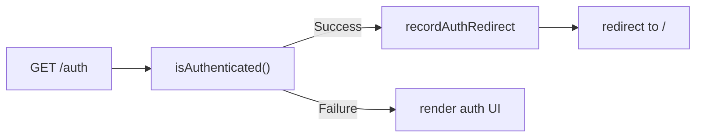

# Auth redirect telemetry

Why the app records `auth.redirect`, what it measures today, how to use it in Azure Monitor, and what to do next.

> **Implementation index:** `\`path/to/file.ts:Lstart–Lend\`` — source line range for the described behavior.

**Quick reference:** [telemetry-reference.md](./telemetry-reference.md)

Related:

- [Refresh token flow, telemetry, and roadmap](./refresh-token.md)
- [Azure Monitor OpenTelemetry (server-only)](./azure-monitor-opentelemetry.md)

---

## Summary

| Item             | Detail                                            | Source |
| ---------------- | ------------------------------------------------- | ------ |
| Metric           | `auth.redirect.count`                             | `registry-factory.ts:80`, `196-200` |
| Log event        | `"Auth redirect"` (`logServerInfo`)               | `helpers.ts:94-98` |
| Trigger today    | Logged-in user visits `/auth` → redirected to `/` | `auth.tsx:24-30` |
| Reason attribute | `already_authenticated`                           | `auth.tsx:28` |
| Route attribute  | `route_id=/auth`                                  | `auth.tsx:29`, `helpers.ts:110` |
| Nature           | **Success-path guard**, not an auth failure       | — |

---

## Why record it?

Auth and session health need observable server-side signals. Dedicated refresh telemetry is still thin (refresh runs only when the session cookie exists **without** an `accessToken`; see [refresh-token.md](./refresh-token.md)). Until richer auth instrumentation ships, `auth.redirect.count` is a practical baseline for auth-route traffic.

Recording this redirect helps with:

1. **Baseline traffic** — steady volume means “already logged in, bounced from `/auth`” is working as designed.
2. **Anomaly detection** — unexpected spikes or drops can hint at redirect loops, session flapping, bad links sending authenticated users to `/auth`, or changes in `isAuthenticated` behavior.
3. **Incident correlation** — during triage, correlate refresh failures, `auth.redirect` spikes, and route loader errors in the same time window (see [Roadmap](#roadmap) Phase 3).
4. **Structured observability** — one counter plus a structured log with `reason`, `route_id`, and `source: "auth"` for Azure Monitor queries and traces.

This is **not** “record every redirect in the app.” Only server-side auth-route redirects emitted via `recordAuthRedirect()` are counted.

---

## What triggers it today

Single call site: `/auth` route `beforeLoad` in `src/routes/auth.tsx:24-30`.

Flow:

1. User requests `/auth`.
2. `beforeLoad` runs `isAuthenticated()` (`is-authenticated.ts`) — server function.
3. On `Success`, the user is already authenticated.
4. `recordAuthRedirect({ reason: "already_authenticated", routeId: "/auth" })` — `helpers.ts:85-98`.
5. Router redirects to `/`.



Implementation chain:

| Layer       | File                              | Role                                         | Lines |
| ----------- | --------------------------------- | -------------------------------------------- | ----- |
| Route guard | `src/routes/auth.tsx`             | Calls `recordAuthRedirect` before redirect   | L24–L30 |
| Helper      | `src/server/telemetry/helpers.ts` | `recordAuthRedirect` → `recordMetric` + log  | L85–L117 |
| Meter       | `src/server/telemetry/registry-factory.ts` | Increments `auth.redirect.count`     | L80, L196-200 |
| Preload     | `instrument.server.mjs`           | Same meter registration at process bootstrap | `instrument.ts:20`, `setup.ts:65-131` |

The helper accepts optional `reason` and `routeId` for future call sites (for example protected-route redirects to `/auth`) without introducing a new metric name.

---

## Signals emitted

### Counter

- **Name:** `auth.redirect.count`
- **Attributes:** `reason`, `route_id` (low-cardinality route id via `normalizeRouteId`)

### Log

Structured info log via `logServerInfo`:

```json
{
  "msg": "Auth redirect",
  "reason": "already_authenticated",
  "route_id": "/auth",
  "source": "auth"
}
```

Plus standard correlation fields (`correlationId`, trace ids) when telemetry is enabled.

### Server-only

`recordAuthRedirect` no-ops on the client and when telemetry is disabled — `helpers.ts:70`, `103`; `config.ts:35-36`.

---

## What it is not

- **Not an auth failure signal** — today it fires on the happy path when an authenticated user hits the login route.
- **Not session expiry** — forced logout and redirect to `/auth` are not instrumented here yet.
- **Not a substitute for refresh metrics** — refresh counters remain near zero for most traffic until proactive refresh on `401` ships.

Do not alert on `auth.redirect.count` alone without context. Treat it as baseline traffic plus a hook for future `reason` values.

---

## How to use in Azure Monitor (today)

Until Phase 1 instrumentation in [refresh-token.md](./refresh-token.md) lands, prioritize signals users actually feel:

1. **`auth.redirect.count`** — baseline and anomaly detection (`reason=already_authenticated`).
2. **`isAuthenticated` / `getLoggedUser` failures** — server function exceptions via `handleServerFnFailure` and route loader errors.
3. **API 4xx on authenticated resources** — traces on `apiClient.*` spans with `http.status_code` (not `http.client.errors`; 4xx are excluded by design).
4. **`auth.token_refresh.failures`** — secondary metric; low volume until refresh runs on the hot path.

Example Kusto-style questions (adapt to your App Insights workspace):

- Count auth redirects over time, grouped by `reason`.
- Compare `auth.redirect.count` with loader error rate and `auth.token_refresh.failures` in the same window.

---

## What to do next

Two parallel tracks: **ship and validate telemetry**, then **close auth instrumentation and behavior gaps**.

### Track A — Ship Azure Monitor (ops)

The Sentry → Azure Monitor migration is implemented in code. Next steps are environment validation:

1. Enable telemetry in staging: `TELEMETRY_ENABLED=true` plus connection string or VM managed identity and App Insights RBAC.
2. Exercise the app and confirm traces, logs, and metrics in Azure (request spans, `auth.redirect.count`, axios dependency metrics).
3. Confirm `/ready` reports `telemetry: "up"`.
4. Run release gates from [production-readiness-checklist.md](./production-readiness-checklist.md).

### Track B — Auth telemetry and behavior (engineering)

Recommended order:

```text
Phase 1 — Instrumentation (low risk, no behavior change)
     ↓
Phase 2 — Proactive refresh on 401 (behavior change)
     ↓
Phase 3 — Alerting and SLOs
```

#### Phase 1 — Instrumentation completeness

- [ ] Record refresh success/failure on **Effect exit**, not only axios HTTP settlement.
- [ ] Add `reason` on refresh failure metrics (`invalid_refresh_token`, `user_not_found`, `network`, `server_error`, `schema_error`).
- [ ] Add `auth.token_refresh.duration` histogram.
- [ ] Add `auth.session_cleared.count` with `reason` (`refresh_failed`, `logout`, `password_changed`, `account_deleted`, `role_mismatch`).
- [ ] Document auth metrics in [azure-monitor-opentelemetry.md](./azure-monitor-opentelemetry.md).
- [ ] Optionally extend `recordAuthRedirect` with additional `reason` values (session cleared → `/auth`, protected-route guard).

Keep `recordAuthRedirect` as-is for the `/auth` guard; Phase 1 adds the metrics that reflect real auth failures.

#### Phase 2 — Proactive refresh on 401

- [ ] Axios response interceptor (server-only): on `401`, refresh, update session, retry original request once.
- [ ] Guard against refresh loops (skip if already retried or URL is `/auth/refresh`).
- [ ] On refresh failure → `deleteSession()` and propagate `401`.

This is the largest user-facing gap: expired `accessToken` still in the cookie is sent until the backend rejects it, **without** attempting refresh.

#### Phase 3 — Alerting and SLOs (after Phase 2)

| Alert                | Condition                                                      | Notes            |
| -------------------- | -------------------------------------------------------------- | ---------------- |
| Refresh failure rate | `failures / count > 5%` over 5 min                             | Tune per traffic |
| Refresh latency      | p95 `auth.token_refresh.duration` > 2s                         | Auth API SLO     |
| Session clear storm  | `auth.session_cleared` with `reason=refresh_failed` spike      | Logout wave      |
| Correlation          | Refresh failures + `auth.redirect` + loader errors same window | Incident triage  |

Do not alert on `auth.token_refresh.*` alone before Phase 2; counters stay near zero today.

---

## File reference

| Path                                            | Purpose                                                      | Lines |
| ----------------------------------------------- | ------------------------------------------------------------ | ----- |
| `src/routes/auth.tsx`                           | Emits `auth.redirect` on already-authenticated `/auth` visit | L24–L30 |
| `src/server/telemetry/helpers.ts`               | `recordAuthRedirect`, `recordMetric`, `normalizeRouteId`     | L85–L117, `resource.ts:25-27` |
| `src/server/telemetry/registry-factory.ts`      | `auth.redirect.count` meter registration                     | L80, L196-200 |
| `instrument.server.mjs`                         | Bootstrap meter registration                                 | via `instrument.ts:20` |
| `src/modules/shared/guards/is-authenticated.ts` | Session check invoked from `/auth` `beforeLoad`              | — |

---

## Changelog

| Date       | Change                                                                     |
| ---------- | -------------------------------------------------------------------------- |
| 2026-07-04 | Initial document — rationale, signals, monitoring guidance, and next steps |
