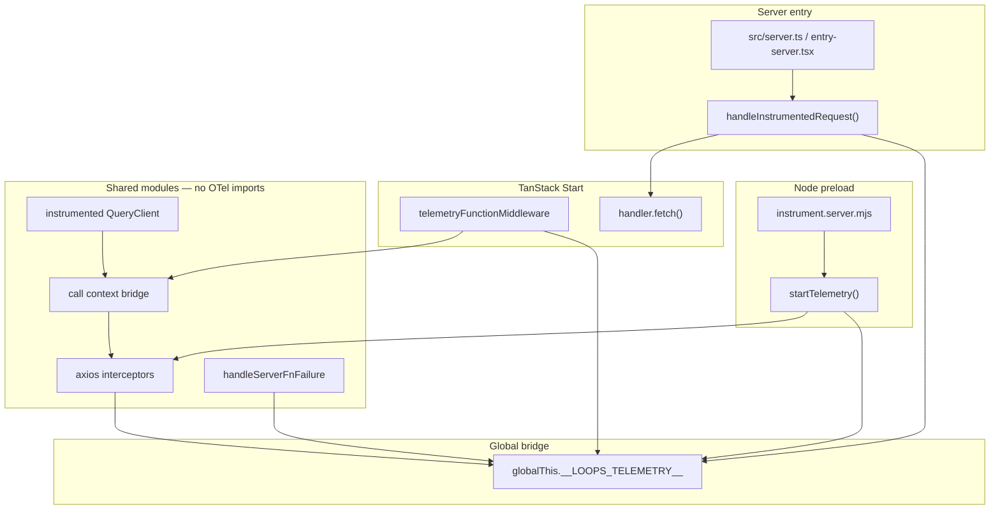

# Azure Monitor OpenTelemetry (server-only)

This document describes the migration from Sentry to **server-only** Azure Monitor OpenTelemetry in the TanStack Start app: what changed, how telemetry is wired, and every custom metric and log event.

> **Implementation index:** `\`path/to/file.ts:Lstart–Lend\`` — source line range for the described behavior.

**Quick reference:** [telemetry-reference.md](./telemetry-reference.md) — full architecture, pipeline, module map, and usage guide.

Aligned with [TanStack Start Observability](https://tanstack.com/start/v0/docs/framework/react/guide/observability). No client-side telemetry, RUM, or browser error reporting.

**API call tracing:** Outbound axios calls include caller context (`beforeLoad`, `query.fetch`, `serverFn`, etc.). See [api-call-tracing.md](./api-call-tracing.md) for how it works, Azure portal navigation, and Log Analytics KQL examples.

---

## Summary

| Before                                          | After                                                                            |
| ----------------------------------------------- | -------------------------------------------------------------------------------- |
| `@sentry/tanstackstart-react` (client + server) | `@azure/monitor-opentelemetry` + `@opentelemetry/api` (server only)              |
| Hardcoded / env Sentry DSN                      | `APPLICATIONINSIGHTS_CONNECTION_STRING` when `TELEMETRY_ENABLED=true`            |
| Browser replay + client `captureException`      | Removed — no client observability                                                |
| Sentry middleware on all requests/functions     | Custom middleware + request wrapper; **UI page routes only**                     |
| Console + Sentry for errors                     | Span events + Azure Monitor export; **no server console logging from telemetry** |

---

## Architecture



**Call context:** Route hooks, React Query, and server functions push caller metadata onto an AsyncLocalStorage stack (server) or client stack. Axios interceptors read it and attach `api.caller.*` to dependency spans and metrics. Details: [api-call-tracing.md](./api-call-tracing.md).

**Startup:** `instrument.server.mjs` (bundled from `src/server/telemetry/instrument.ts:L1–L20`) runs via `NODE_OPTIONS='--import ./instrument.server.mjs'` (`package.json`) before the app loads. It calls `startTelemetry()` (`setup.ts:65-131`), which initializes Azure Monitor and sets `globalThis.__LOOPS_TELEMETRY__` (`registry-factory.ts:37-313`, `registry.ts:120-128`).

**Bridge pattern:** Shared code (`handle-server-fn-failure.ts:L27-34`, axios) uses the global registry so OpenTelemetry/Azure packages never enter the client bundle.

---

## Changed files

### Dependencies and build

| File                    | Change                                                                                                                                                                                                          |
| ----------------------- | --------------------------------------------------------------------------------------------------------------------------------------------------------------------------------------------------------------- |
| `package.json`          | Removed `@sentry/tanstackstart-react`. Added `@azure/monitor-opentelemetry`, `@opentelemetry/api`, `esbuild`. Added `build:instrument`, `test`, `typecheck` scripts. `dev`/`build` run instrument bundle first. |
| `pnpm-lock.yaml`        | Lockfile refresh for dependency swap.                                                                                                                                                                           |
| `instrument.server.mjs` | Generated by esbuild from `src/server/telemetry/instrument.ts` (do not edit by hand).                                                                                                                           |
| `vite.config.ts`        | Removed `sentryTanstackStart` plugin. Workbox `mode: "development"` to avoid terser failures in constrained CI/sandbox builds.                                                                                  |
| `vitest.config.ts`      | Added (test runner config; test files were removed per project decision).                                                                                                                                       |

### New server telemetry module (`src/server/telemetry/`)

| File              | Lines   | Purpose                                                                                                 |
| ----------------- | ------- | ------------------------------------------------------------------------------------------------------- |
| `instrument.ts`   | L1–L20  | Preload entry: `startTelemetry()`.                                                                      |
| `setup.ts`        | L38–L131 | Azure Monitor init, active registry, custom metrics, axios hooks, span helpers.                         |
| `config.ts`       | L25–L52 | Env parsing: enable switch, connection string, log level, sample rate, service name.                    |
| `registry.ts`     | L18–L141 | Global accessor (`getTelemetry`, `setTelemetry`, `logTelemetry`, `recordServerException`).              |
| `types.ts`        | —       | `TelemetryRegistry`, log levels, request context types.                                                 |
| `request.ts`      | L31–L108 | `handleInstrumentedRequest`: probes, page-route filter, request metrics/spans, correlation header.      |
| `middleware.ts`   | L49–L119 | TanStack function middleware; replays call stack, serverFn spans.                        |
| `page-route.ts`   | L37–L43 | `isPageRoute()` — UI routes vs static assets / `/_serverFn` / tooling.                                  |
| `health.ts`       | L31–L47 | `/health` and `/ready` JSON payloads.                                                                   |
| `redact.ts`       | L11–L87 | Sensitive key/value redaction for attributes and messages.                                              |
| `effect.ts`       | L24–L40 | Effect-based `runTelemetryExit`, `runSyncOrElse`, `runSyncExitOrElse` (no try/catch in telemetry code). |
| `call-context.ts` | L7–L40  | Server AsyncLocalStorage stack for caller context.                                                      |
| `axios-hooks.ts`  | L31–L165 | Global axios interceptors.                                                                              |
| `registry-factory.ts` | L37–L313 | Meter/tracer/registry implementation.                                                              |

### Call context modules (`src/modules/shared/telemetry/` + query client)

| File                                   | Lines   | Purpose                                                       |
| -------------------------------------- | ------- | ------------------------------------------------------------- |
| `call-context.types.ts`                | —       | `ApiCallSource`, `ApiCallContext` types                       |
| `call-context-path.ts`                 | L6–L46  | Maps context stack → OTel span/metric attribute keys            |
| `call-context-wire.ts`                 | L4–L60  | Effect Schema encode/decode for `x-loops-call-stack` header     |
| `run-with-call-context.ts`             | L33–L108 | Isomorphic context runner + server bridge registration          |
| `install-client-telemetry-fetch.ts`    | L17–L80 | Patches browser `fetch` for session + call stack propagation  |
| `create-instrumented-query-client.ts`  | —       | Tags React Query fetch/invalidate/mutation paths              |

### Server wiring

| File                   | Lines   | Change                                                                                         |
| ---------------------- | ------- | ---------------------------------------------------------------------------------------------- |
| `src/server.ts`        | L9–L13  | `handleInstrumentedRequest` wraps `handler.fetch` (replaces `wrapFetchWithSentry`).            |
| `src/entry-server.tsx` | L8–L12  | Same instrumentation wrapper as `server.ts`.                                                   |
| `src/start.ts`         | L8–L12  | `telemetryFunctionMiddleware` replaces Sentry global middleware.                               |

### Sentry removal (client + shared)

| File                                                              | Change                                                                                                                                          |
| ----------------------------------------------------------------- | ----------------------------------------------------------------------------------------------------------------------------------------------- |
| `src/router.tsx`                                                  | Removed client `Sentry.init` block.                                                                                                             |
| `src/modules/shared/components/common/global-error-component.tsx` | Removed `captureException` on client errors.                                                                                                    |
| `src/modules/shared/utils/handle-server-fn-failure.ts`            | Reports `UnknownError` / defects via `globalThis.__LOOPS_TELEMETRY__?.recordException()`; domain errors (e.g. `Unauthorized`) are not reported. |

### Incidental fixes (same branch)

| File                                                               | Change                                                                                         |
| ------------------------------------------------------------------ | ---------------------------------------------------------------------------------------------- |
| `src/modules/shared/api/auth/refresh.ts`                           | Strict optional headers for axios POST (TypeScript `exactOptionalPropertyTypes`).              |
| `src/modules/profile/components/settings/preferences/constants.ts` | Explicit `languageOptions` typing.                                                             |
| `src/modules/shared/i18n/languages.ts`                             | New `AppLanguage` type.                                                                        |
| `src/modules/shared/utils/axios.ts`                                | Uses shared axios instance; dependency metrics come from interceptors installed in `setup.ts`. |

### Configuration and docs

| File                                     | Change                                          |
| ---------------------------------------- | ----------------------------------------------- |
| `.env.example`                           | Telemetry env vars; Sentry vars removed.        |
| `.gitignore`                             | `!.env.example` so example env is tracked.      |
| `README.md`                              | Sentry env docs replaced with telemetry vars.   |
| `docs/production-readiness-checklist.md` | Updated gates, metrics mapping, security notes. |

### Not tracked / generated

| Path                                 | Notes                                    |
| ------------------------------------ | ---------------------------------------- |
| `.cursor/plans/`                     | Internal migration plan (untracked).     |
| `graphify-out/cache/stat-index.json` | Graphify cache update from code changes. |

---

## Environment variables

All telemetry variables are **server-only** — never use a `VITE_` prefix. Schema: `schema.ts:175-214`; parser: `config.ts:25-52`; example: `.env.example:7-15`.

| Variable                                | Required         | Default                 | Description                                                                            | Source |
| --------------------------------------- | ---------------- | ----------------------- | -------------------------------------------------------------------------------------- | ------ |
| `TELEMETRY_ENABLED`                     | No               | `false`                 | Global kill switch (`true`/`1`/`on`/`yes`).                                            | `schema.ts:87-110` |
| `APPLICATIONINSIGHTS_CONNECTION_STRING` | Yes when enabled | —                       | Azure Application Insights connection string (dev and prod).                           | `schema.ts:138-149` |
| `TELEMETRY_LOG_LEVEL`                   | No               | `info`                  | Minimum level for span log events: `trace`, `debug`, `info`, `warn`, `error`, `fatal`. | `schema.ts:112-136` |
| `OTEL_SERVICE_NAME`                     | No               | `loops-app`             | OpenTelemetry meter/tracer resource name.                                              | `schema.ts:175-186` |
| `TELEMETRY_TRACES_SAMPLE_RATE`          | No               | `1` (dev), `0.1` (prod) | Trace sampling ratio `0`–`1`.                                                          | `schema.ts:151-173` |

**Removed (no longer used):** `SENTRY_DSN`, `VITE_SENTRY_DSN`, `SENTRY_AUTH_TOKEN`, `TELEMETRY_AUTH_MODE`, `AZURE_CLIENT_ID`, `AZURE_TENANT_ID`.

---

## Custom metrics

All metrics use the meter named `OTEL_SERVICE_NAME` (default `loops-app`). Created in `registry-factory.ts:40-80`, recorded via `TelemetryRegistry.metrics` (`registry-factory.ts:150-242`).

### HTTP server (incoming UI page requests)

Recorded in `request.ts:61-84` via `recordRequestStart` / `recordRequestEnd` (`registry-factory.ts:223-232`). Only routes passing `isPageRoute()` (`page-route.ts:37-43`).

| Metric name                    | Type          | Unit | Attributes                                                | When recorded                                     | Source |
| ------------------------------ | ------------- | ---- | --------------------------------------------------------- | ------------------------------------------------- | ------ |
| `http.server.request.duration` | Histogram     | `ms` | `status_class`: `1xx` \| `2xx` \| `3xx` \| `4xx` \| `5xx` | End of each instrumented page request             | `registry-factory.ts:43-46`, `223-227` |
| `http.server.requests`         | Counter       | —    | `status_class`                                            | End of each instrumented page request (+1)        | `registry-factory.ts:50`, `227` |
| `http.server.active_requests`  | UpDownCounter | —    | —                                                         | +1 at request start, −1 at request end            | `registry-factory.ts:47-49`, `230-231` |
| `http.server.cancellations`    | Counter       | —    | —                                                         | Request aborted (`AbortSignal`) before completion | `registry-factory.ts:51`, `228` |

**`status_class` mapping** (`statusClass()` in `http-status.ts:10-17`):

- `5xx` — status ≥ 500
- `4xx` — status ≥ 400
- `3xx` — status ≥ 300
- `2xx` — status ≥ 200
- `1xx` — otherwise

### HTTP client (outgoing API dependencies)

Recorded in axios response/error interceptors (`axios-hooks.ts:74-120`; installed `registry-factory.ts:310`).

| Metric name                       | Type      | Unit | Attributes                                                                                                                       | When recorded                                                       | Source |
| --------------------------------- | --------- | ---- | -------------------------------------------------------------------------------------------------------------------------------- | ------------------------------------------------------------------- | ------ |
| `http.client.request.duration`    | Histogram | `ms` | `method`, `resource`, `status_class`, `caller_type`, `caller_name`, `caller_query_key`, `caller_route_id`, `caller_triggered_by` | Every axios response or error (app-level)                           | `registry-factory.ts:69-74`, `151-179` |
| `http.client.dependency.duration` | Histogram | `ms` | `status_class`: `2xx`–`5xx` or `none` if no response                                                                             | Every axios response or error (generic dependency)                  | `registry-factory.ts:58-61`, `180-183` |
| `http.client.errors`              | Counter   | —    | `status_class` (+ caller dims on app-level counter)                                                                              | Response/error where status is **5xx or missing** (network/timeout) | `registry-factory.ts:62-63`, `184-189`; check `isServerErrorStatus` `http-status.ts:5-8` |
| `http.client.timeouts`            | Counter   | —    | —                                                                                                                                | Axios error code `ECONNABORTED` or `ETIMEDOUT`                      | `registry-factory.ts:63`, `191` |
| `http.client.retries`             | Counter   | —    | —                                                                                                                                | Reserved; currently always `retried: false`                         | `registry-factory.ts:64`, `216` |

**Error semantics:** Only **5xx** and **missing status** (network failure) count as dependency errors. **4xx** are logical/client errors and do not increment `http.client.errors`.

**Caller dimensions** on `http.client.request.duration` are documented in [api-call-tracing.md](./api-call-tracing.md).

### TanStack server functions

| Metric name                   | Type      | Unit | Attributes                 | Status                                   | Source |
| ----------------------------- | --------- | ---- | -------------------------- | ---------------------------------------- | ------ |
| `tanstack.server_fn.duration` | Histogram | `ms` | `server_fn`: function name | Emitted by `telemetryFunctionMiddleware` | `registry-factory.ts:52-55`, `233-237`; `middleware.ts:90-95` |
| `tanstack.server_fn.errors`   | Counter   | —    | `server_fn`                | Emitted on server function failure       | `registry-factory.ts:56`, `236` |
| `tanstack.server_fn.timeouts` | Counter   | —    | `server_fn`                | Emitted when `AbortSignal` aborts        | `registry-factory.ts:57`, `237` |

Unexpected server function failures are still captured as **exceptions** via `handleServerFnFailure` (`handle-server-fn-failure.ts:27-34`), not these counters.

---

## Logging

Telemetry does **not** write to the server console. Logs are emitted as **OpenTelemetry span events** on the active span and exported to Azure Monitor.

### Log levels

Configured by `TELEMETRY_LOG_LEVEL`. Numeric order (lower = more verbose):

| Level   | Order | Typical use                 |
| ------- | ----- | --------------------------- |
| `trace` | 10    | Fine-grained diagnostics    |
| `debug` | 20    | Development detail          |
| `info`  | 30    | Normal operations (default) |
| `warn`  | 40    | Recoverable issues          |
| `error` | 50    | Failures                    |
| `fatal` | 60    | Critical failures           |

Events below the configured minimum are dropped.

### How logs are stored

Each log call:

1. Checks level against `TELEMETRY_LOG_LEVEL`.
2. Requires an **active span** (no span → no event).
3. Redacts message and attributes via `redact.ts`.
4. Calls `span.addEvent(message, attributes)`.

**Standard event attributes:**

| Attribute        | Source                                             |
| ---------------- | -------------------------------------------------- |
| `log.level`      | Level passed to `log()`                            |
| `correlation.id` | Request context (`AsyncLocalStorage`) when present |
| Custom keys      | Caller-supplied attributes (redacted)              |

### Public logging API

| API                                         | Location            | Description                                       |
| ------------------------------------------- | ------------------- | ------------------------------------------------- |
| `registry.log(level, message, attributes?)` | `TelemetryRegistry` | Core log method                                   |
| `logTelemetry(level, message, attributes?)` | `registry.ts`       | Convenience wrapper around `getTelemetry().log()` |

### Automatic log events

| Event              | Level   | Message                | Attributes                            | Trigger                                            |
| ------------------ | ------- | ---------------------- | ------------------------------------- | -------------------------------------------------- |
| Telemetry started  | `info`  | `"Telemetry started"`  | `sampleRate`, `serviceName`           | Successful `startTelemetry()`                      |
| Exception recorded | `error` | Redacted error message | Caller attributes + `exception: true` | `recordException()` after `span.recordException()` |

No other code paths call `logTelemetry()` today. Application code can use `logTelemetry()` or `getTelemetry().log()` inside an active span for structured server-side logs.

### Redaction (`redact.ts`)

Applied to all log messages and span attributes:

**Sensitive keys (replaced with `[REDACTED]`):**  
`authorization`, `cookie`, `set-cookie`, `password`, `passwd`, `secret`, `token`, `access_token`, `refresh_token`, `api_key`, `session`, `ssn`, `email`, `phone`, `credit_card` (and common variants).

**String patterns redacted in values:**

- Bearer tokens
- JWT-shaped strings (`eyJ…`)
- Email addresses

---

## Traces and spans

### Span creation

| Span name pattern                       | Where                            | Attributes                                                                                                                                                    | Lines |
| --------------------------------------- | -------------------------------- | ------------------------------------------------------------------------------------------------------------------------------------------------------------- | ----- |
| `METHOD /pathname`                      | `request.ts`                     | `http.method`, `http.route` (pathname only — never query string), `correlation.id` (request wrapper)                                                          | `request.ts:89-96` |
| `beforeLoad.{routeId}`                  | `instrumentBeforeLoad()`         | `routeId`, `api.caller.*`                                                                                                                                     | `helpers.ts:47-62` |
| `auth.sessionCheck` / `serverFn.{name}` | `telemetryFunctionMiddleware`    | `serverFunctionName`, `api.caller.*`                                                                                                                          | `middleware.ts:104-111`, `helpers.ts:120-122` |
| `apiClient.{METHOD}.{resource}`         | axios interceptors               | `http.method`, `resource`, **`api.caller.*`**, `browser.session.id`                                                                                           | `axios-hooks.ts:57-64` |

**Log Analytics:** Filter `dependencies | where name startswith "apiClient."`. Full query guide: [api-call-tracing.md](./api-call-tracing.md).

### Span status (HTTP responses)

`markHttpResponse(statusCode)` on the active span (`registry-factory.ts:137-148`):

- Sets `http.status_code`
- **5xx** → span status `ERROR`
- **4xx and below** → span status `OK` (logical errors, not infrastructure failures)

### Exceptions on spans

`recordException(error, attributes?)`:

- `span.recordException(error)`
- Span status `ERROR` with redacted message
- Redacted custom attributes on span
- Log event at `error` level (see above)

**Sources:**

- Uncaught errors in `withSpan` / `runTelemetryExit`
- `handleServerFnFailure` for `UnknownError` and Effect defects only

### Auto-instrumentation disabled for incoming HTTP

`buildAzureMonitorOptions()` sets `disableIncomingRequestInstrumentation: true` (`setup.ts:51-53`) so Azure’s HTTP plugin does not create spans for static assets, `/_serverFn`, source maps, etc. Only the custom page-route wrapper creates incoming request spans (`request.ts:55-106`).

### Trace propagation

**Incoming:** Reads `traceparent`, `tracestate`, `x-correlation-id` from request headers.

**Outgoing (axios):** Injects `traceparent`, `tracestate`, `x-correlation-id` on downstream API calls.

**Response:** Sets `x-correlation-id` on instrumented page responses.

---

## Route filtering (`isPageRoute`)

Only **frontend UI page routes** are instrumented (e.g. `/auth`, `/explore`) — `page-route.ts:37-43`.

**Excluded** (`page-route.ts:13-30`):

- Exact paths: `/health`, `/ready`, `/sw.js`, `/favicon.ico`, `/robots.txt`, `/sitemap.xml`, `/manifest.webmanifest`
- Prefixes: `/_serverFn`, `/_server`, `/assets/`, `/icons/`, `/workbox-`, `/@`, `/node_modules/`, `/.well-known`, `/__vite`, etc.
- Static file extensions: `.js`, `.map`, `.css`, images, fonts, `.json`, `.wasm`, etc.
- Workbox bundles: `/workbox-*`

Probes (`/health`, `/ready`) are handled explicitly in `request.ts:39-52` and return JSON without full request instrumentation.

---

## Health endpoints

| Path          | Purpose   | Response fields                                                                                   |
| ------------- | --------- | ------------------------------------------------------------------------------------------------- |
| `GET /health` | Liveness  | `status: "ok"`, `uptime`, `memory.rss`, `timestamp`, `version`                                    |
| `GET /ready`  | Readiness | `status: "ready"`, `telemetry: "disabled" \| "down" \| "up"`, `uptime`, `memory.rss`, `timestamp` |

Both responses include `x-correlation-id` when a correlation ID is available.

---

## Telemetry status

| Status     | Meaning                                                       |
| ---------- | ------------------------------------------------------------- |
| `disabled` | `TELEMETRY_ENABLED` is false                                  |
| `down`     | Enabled but invalid config or startup failure (noop registry) |
| `up`       | Azure Monitor initialized successfully                        |

---

## Build and runtime

```bash
# Dev — rebuilds instrument preload, then starts Vite
pnpm dev

# Production build — instrument bundle + app build
pnpm build

# Production start — uses bundled instrument from .output/server/
pnpm start
```

**Scripts:**

- `build:instrument` — esbuild bundles `src/server/telemetry/instrument.ts` → `instrument.server.mjs` (external node packages).
- `dev` — `--import ./instrument.server.mjs`
- `start` — `--import ./.output/server/instrument.server.mjs`

---

## Verification

```bash
pnpm typecheck
pnpm build
rg -i "applicationinsights|@azure/monitor|opentelemetry|useAzureMonitor|__LOOPS_TELEMETRY__|sentry" .output/public || true
```

Expected: no Sentry or OpenTelemetry/Azure strings in the **client** public bundle (`.output/public`).

---

## Known gaps and risks

1. **Server function noise** — Every `/_serverFn` call records `tanstack.server_fn.*` metrics; filter by name in dashboards if needed.
2. **Retry metric** — `http.client.retries` is never incremented (`retried: false` always).
3. **Logs require active span** — `log()` / `logTelemetry()` no-op without a span; background jobs need `withSpan` first.
4. **Stale preload during HMR** — `normalizeRegistry()` fills missing methods if an old `instrument.server.mjs` is loaded (`registry.ts:131-141`); restart dev server after telemetry API changes.
5. **No client error reporting** — Browser errors are no longer sent anywhere; only server-side failures are observed.
6. **Connection string in env** — Treat `APPLICATIONINSIGHTS_CONNECTION_STRING` as a secret; never commit real values (use `.env.example` placeholders only).
