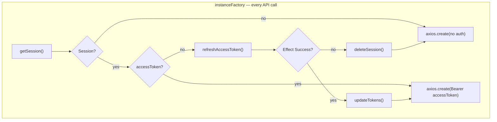

# Refresh token flow, telemetry, and roadmap

This document describes how refresh tokens work in the Loops TanStack Start app today, what is (and is not) monitored, known gaps, and planned improvements.

> **Implementation index:** `\`path/to/file.ts:Lstart–Lend\`` — source line range for the described behavior.

**Quick reference:** [telemetry-reference.md](./telemetry-reference.md)

Related:

- [Azure Monitor OpenTelemetry (server-only)](./azure-monitor-opentelemetry.md)
- [Auth redirect telemetry](./auth-redirect-telemetry.md) — why `auth.redirect.count` exists and what to do next

---

## Summary

| Area                       | Status                                                                                                         | Source |
| -------------------------- | -------------------------------------------------------------------------------------------------------------- | ------ |
| Refresh API call           | Implemented (`refreshAccessToken`)                                                                             | `refresh.ts:32-67` |
| Session storage            | HTTP-only cookie (`session` JWT with `accessToken` + `refreshToken`)                                           | `session.ts` |
| When refresh runs          | Only when session exists **without** an `accessToken`                                                          | `axios.ts` (`instanceFactory`) |
| Proactive refresh on 401   | **Not implemented**                                                                                            | — |
| Dedicated telemetry        | Counters + span on HTTP layer only                                                                             | `refresh.ts:69-92`, `registry-factory.ts:76-79`, `239-241` |
| Auth-route redirect signal | `auth.redirect.count` — baseline guard traffic; see [auth-redirect-telemetry.md](./auth-redirect-telemetry.md) | `auth.tsx:24-30` |

---

## Architecture

### Session model

Tokens live in an HTTP-only, signed session cookie (`src/modules/shared/shell/session/session.ts`):

- `accessToken` — sent as `Authorization: Bearer …` on API calls
- `refreshToken` — used only server-side to obtain new tokens

Cookie lifetime: 30 days. Tokens are written on login / Google login and updated after a successful refresh via `updateTokens()`.

### Refresh trigger (current)

Refresh is **not** on the hot path for most authenticated requests. It runs only inside `instanceFactory()` when:

1. A session cookie exists, **and**
2. `session.accessToken` is falsy (missing or empty string)

After login, both tokens are always stored. There is no interceptor that clears a stale `accessToken` or retries on `401 Unauthorized`. An expired access token still in the cookie is sent until the backend rejects it — **without** attempting refresh.

### API surface

| File                                          | Role                                               | Lines |
| --------------------------------------------- | -------------------------------------------------- | ----- |
| `src/modules/shared/api/auth/refresh.ts`      | `refreshAccessToken()` — POST `/auth/refresh`      | L32–L67 |
| `src/modules/shared/utils/axios.ts`           | `instanceFactory()` — sole caller of refresh       | — |
| `src/modules/shared/shell/session/session.ts` | Cookie read/write, `updateTokens`, `deleteSession` | — |

**Domain errors** (parsed from API 4xx body, not counted as infrastructure failures):

- `invalid_refresh_token`
- `user_not_found`
- `InvalidInput` (validation)

---

## Telemetry today

### Dedicated refresh instrumentation

`instrumentRefreshRequest()` in `refresh.ts:69-92` wraps the raw `axios.post` **before** `parseApiResponse` runs.

| Signal    | Name / detail                 | When recorded                                              | Source |
| --------- | ----------------------------- | ---------------------------------------------------------- | ------ |
| Span      | `auth.refreshToken`           | Around the HTTP POST                                       | (via axios hooks — no dedicated span name in refresh.ts) |
| Counter   | `auth.token_refresh.count`    | Every instrumented refresh attempt                         | `refresh.ts:81`, `registry-factory.ts:239-241` |
| Counter   | `auth.token_refresh.failures` | When the axios promise rejects (network, timeout, non-2xx) | `refresh.ts:86`, `registry-factory.ts:241` |
| Log event | `"Token refresh failed"`      | Same as failure counter (`logServerError`)                 | `refresh.ts:87-89` |

Attributes on span: `source: "refreshAccessToken"` — `refresh.ts:88`; correlation via `buildCorrelationAttributes` `helpers.ts:22-44`.

**Redaction:** `refresh_token` and JWT-shaped values — `redact.ts:11-87`. Refresh token value is never logged.

### Overlap with global axios hooks

The refresh call uses the default `axios` module, so global interceptors in `axios-hooks.ts:31-165` also record:

- Span: `apiClient.POST.auth_refresh` (resource normalized from URL) — `resource.ts:7-22`
- Histogram: `http.client.request.duration` — `registry-factory.ts:151-179`
- Counters: `http.client.errors` (5xx / missing status only — **4xx do not increment**) — `http-status.ts:5-8`

This means a single refresh attempt can appear in traces twice (`auth.refreshToken` + `apiClient.POST.auth_refresh`) and in both auth-specific and generic HTTP metrics.

### Related auth signals (higher user impact today)

See [auth-redirect-telemetry.md](./auth-redirect-telemetry.md) for full rationale and monitoring guidance.

| Metric                   | When                                                                                 | Source |
| ------------------------ | ------------------------------------------------------------------------------------ | ------ |
| `auth.redirect.count`    | User redirected away from `/auth` because already authenticated (success-path guard) | `auth.tsx:24-30` |
| `auth.sessionCheck` span | `isAuthenticated` server function                                                    | `helpers.ts:120-122` |
| Generic API 401/403      | Logical errors on authenticated routes — **not** dependency errors                   | `registry-factory.ts:137-148`, `http-status.ts:5-8` |

There is **no** dedicated metric for `deleteSession()` after refresh failure or for silent degradation to an unauthenticated axios instance.

---

## Known gaps

### 1. Refresh rarely executes

Because refresh only runs when `accessToken` is absent from the session cookie, normal post-login traffic almost never hits this path. `auth.token_refresh.*` counters are likely near zero in production unless sessions are malformed or a future flow clears the access token deliberately.

**Implication:** Do not treat refresh metrics as a primary auth health dashboard today.

### 2. Success is HTTP-layer, not business-layer

`instrumentRefreshRequest` records success when axios resolves (2xx). `parseApiResponse` runs afterward:

- A 2xx body that fails schema validation is counted as **success** at the metric layer, then fails in Effect.
- A 4xx with a structured error body is counted as **failure** (axios throws) — aligned with user impact, but indistinguishable from network errors.

**Missing:** Record metrics on **Effect exit** (`Success` vs typed `RefreshErrors`), not only on HTTP promise settlement.

### 3. No failure taxonomy

All failures increment the same `auth.token_refresh.failures` counter. Cannot distinguish:

| Failure type            | Typical cause                   | Desired attribute               |
| ----------------------- | ------------------------------- | ------------------------------- |
| `invalid_refresh_token` | Revoked / expired refresh token | `reason: invalid_refresh_token` |
| `user_not_found`        | User deleted server-side        | `reason: user_not_found`        |
| Network / timeout       | API unreachable                 | `reason: network`               |
| 5xx                     | Backend outage                  | `reason: server_error`          |

### 4. No duration histogram for refresh

Generic `http.client.request.duration` covers the POST, but there is no `auth.token_refresh.duration` histogram for auth-specific SLOs and alerting.

### 5. Session teardown not instrumented

When refresh fails in `instanceFactory`, `deleteSession()` runs with no counter or span event. Correlating forced logouts with refresh failures requires inferring from `auth.token_refresh.failures` spikes.

**Missing:** `auth.session_cleared` counter with `reason: refresh_failed` (and other reasons: logout, password change, account delete).

### 6. No proactive refresh on expired access token

No axios response interceptor retries after `401` with a refresh + single replay. Users with an expired but present `accessToken` never trigger `refreshAccessToken`.

**Missing:** Full refresh-on-401 flow (see roadmap below).

### 7. Not documented in OpenTelemetry reference

`auth.token_refresh.count` and `auth.token_refresh.failures` are defined in `registry-factory.ts:76-79`, `239-241`. Also documented in [telemetry-reference.md](./telemetry-reference.md).

### 8. No alert guidance

No recommended Azure Monitor alert rules for refresh failure rate. With current narrow trigger, alerts on refresh alone would likely be noisy or always silent.

---

## What to monitor today (practical)

Until proactive refresh ships, prioritize signals users actually feel:

1. **`auth.redirect.count`** — unexpected spikes may indicate auth/session issues.
2. **`isAuthenticated` / `getLoggedUser` failures** — via server function exceptions (`handleServerFnFailure`) and route loader errors.
3. **API 4xx on authenticated resources** — investigate via traces (`apiClient.*` spans with `http.status_code`), not `http.client.errors` (4xx excluded by design).
4. **`auth.token_refresh.failures`** — keep as a secondary / insurance metric; useful mainly after roadmap items land.

---

## Roadmap

### Phase 1 — Instrumentation completeness (low risk)

- [ ] Move success/failure recording to **Effect exit** in `refreshAccessToken` (or `instanceFactory`), not only axios HTTP settlement.
- [ ] Add `reason` attribute to refresh failure metrics (`invalid_refresh_token`, `user_not_found`, `network`, `server_error`, `schema_error`).
- [ ] Add `auth.token_refresh.duration` histogram (ms).
- [ ] Add `auth.session_cleared.count` with `reason` (`refresh_failed`, `logout`, `password_changed`, `account_deleted`, `role_mismatch`).
- [ ] Document auth metrics in `azure-monitor-opentelemetry.md` and link here.
- [ ] Deduplicate or nest spans: either rely on `auth.refreshToken` only and skip generic span for `/auth/refresh`, or document double-span as intentional.

### Phase 2 — Proactive refresh on 401 (behavior change)

- [ ] Axios response interceptor (server-only): on `401` from authenticated instance, call `refreshAccessToken`, `updateTokens`, retry original request once.
- [ ] Guard against refresh loops (e.g. skip retry if request was already retried or URL is `/auth/refresh`).
- [ ] On refresh Effect failure → `deleteSession()` + propagate `401` (do not retry again).
- [ ] Optional: clear `accessToken` from session when backend returns token-expired code (if API exposes one), so `instanceFactory` refresh path stays consistent.

### Phase 3 — Alerting and SLOs (after Phase 2)

Suggested Azure Monitor alerts once refresh is on the hot path:

| Alert                | Condition                                                                | Notes                      |
| -------------------- | ------------------------------------------------------------------------ | -------------------------- |
| Refresh failure rate | `auth.token_refresh.failures / auth.token_refresh.count > 5%` over 5 min | Tune threshold per traffic |
| Refresh latency      | p95 `auth.token_refresh.duration` > 2s                                   | Auth API SLO               |
| Session clear storm  | `auth.session_cleared` with `reason=refresh_failed` spike                | User-visible logout wave   |
| Correlation          | Refresh failures + `auth.redirect` + loader errors same window           | Incident triage            |

### Phase 4 — Security and ops (optional)

- [ ] Refresh token rotation audit — ensure new refresh token always persisted after success (already done in `updateTokens`).
- [ ] Rate-limit visibility — if API returns rate-limit errors, add `reason: rate_limited`.
- [ ] Staging validation checklist: expired access token → silent refresh → request succeeds; invalid refresh → session cleared → redirect to `/auth`.

---

## File reference

| Path                                          | Purpose                                                | Lines |
| --------------------------------------------- | ------------------------------------------------------ | ----- |
| `src/modules/shared/api/auth/refresh.ts`      | Refresh API + `instrumentRefreshRequest`               | L32–L92 |
| `src/modules/shared/utils/axios.ts`           | `instanceFactory` refresh orchestration                | — |
| `src/modules/shared/shell/session/session.ts` | Session cookie CRUD                                    | — |
| `src/server/telemetry/registry-factory.ts`    | `auth.token_refresh.*` meter registration              | L76-L79, L239-241 |
| `src/server/telemetry/helpers.ts`             | `recordMetric`, `withServerSpan`, `recordAuthRedirect` | L85–L140 |
| `src/routes/auth.tsx`                         | `auth.redirect.count` on already-authenticated visit   | L24–L30 |

---

## Changelog

| Date       | Change                                                 |
| ---------- | ------------------------------------------------------ |
| 2026-07-04 | Initial document — current behavior, gaps, and roadmap |
