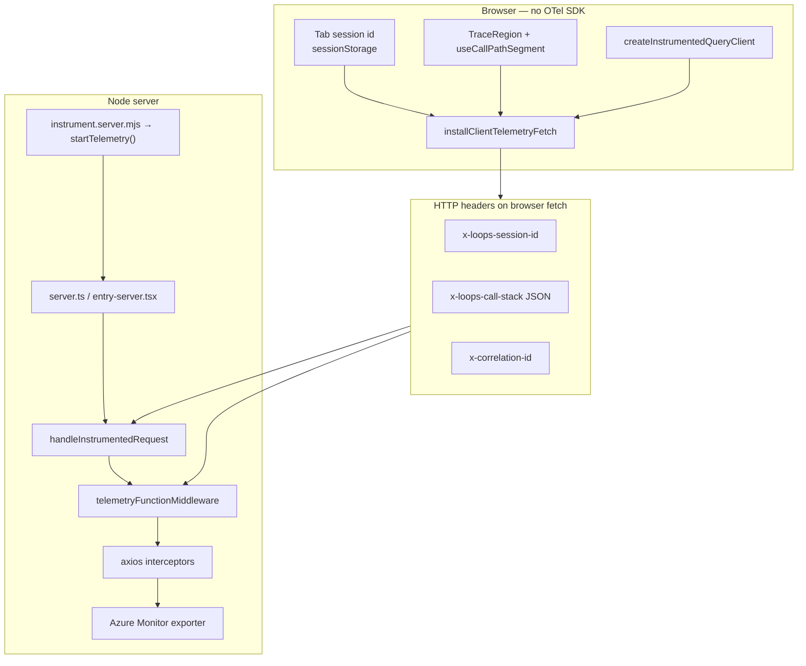

# Monitoring & Telemetry — Reference Guide

Single entry point for the Loops app observability stack: architecture, pipeline, module map, metrics, and usage.

> **Implementation index:** `\`path/to/file.ts:Lstart–Lend\`` — source line range for the described behavior. Jump to `Lstart` in your editor to read the implementation.

**Deep dives:**

| Topic                                             | Doc                                                                |
| ------------------------------------------------- | ------------------------------------------------------------------ |
| Azure Monitor setup, env vars, metrics catalog    | [azure-monitor-opentelemetry.md](./azure-monitor-opentelemetry.md) |
| API caller tracing + Log Analytics KQL            | [api-call-tracing.md](./api-call-tracing.md)                       |
| Where to add `TraceRegion` / `useCallPathSegment` | [call-path-instrumentation.md](./call-path-instrumentation.md)     |
| Auth redirect metric                              | [auth-redirect-telemetry.md](./auth-redirect-telemetry.md)         |
| Refresh token flow + auth metrics roadmap         | [refresh-token.md](./refresh-token.md)                             |

---

## Philosophy

| Principle                | Detail                                                                                                                                 | Source |
| ------------------------ | -------------------------------------------------------------------------------------------------------------------------------------- | ------ |
| **Server-only**          | OpenTelemetry + Azure Monitor run on Node only. No client SDK, no RUM, no browser error reporting.                                     | `setup.ts:38-57`, `setup.ts:65-131` |
| **Bridge pattern**       | Shared code talks to `globalThis.__LOOPS_TELEMETRY__` — OTel/Azure packages never enter the client bundle.                             | `registry.ts:73-78`, `handle-server-fn-failure.ts:27-34` |
| **Page routes only**     | Incoming HTTP spans/metrics for UI pages (`/explore`, `/auth`). Static assets, `/_serverFn`, probes pass through untouched.            | `page-route.ts:37-43`, `request.ts:55-57` |
| **Caller context**       | Every outbound API call is tagged with _who_ triggered it (loader, query, serverFn, hook, route).                                      | `call-context-path.ts:19-46`, `axios-hooks.ts:53-64` |
| **4xx ≠ errors**         | HTTP 4xx are logical failures — they do not increment dependency error counters or mark spans ERROR. Only 5xx and network failures do. | `http-status.ts:5-8`, `registry-factory.ts:137-148`, `axios-hooks.ts:87-88` |
| **Effect at boundaries** | Telemetry code uses Effect helpers (`runSyncOrElse`, `runTelemetryExit`) instead of bare try/catch.                                    | `effect.ts:7-26` (shared), `effect.ts:24-40` (server), `request.ts:71-106` |

Replaced: `@sentry/tanstackstart-react` (client + server). See [azure-monitor-opentelemetry.md](./azure-monitor-opentelemetry.md) for migration summary.

---

## Quick start

### 1. Environment (server-only — never `VITE_` prefix)

```bash
TELEMETRY_ENABLED=true
APPLICATIONINSIGHTS_CONNECTION_STRING=InstrumentationKey=...;IngestionEndpoint=...
TELEMETRY_TRACES_SAMPLE_RATE=1        # dev; use 0.1 in prod
OTEL_SERVICE_NAME=loops-app
TELEMETRY_LOG_LEVEL=info
```

See `.env.example` (`L7–L15`) and env schema `schema.ts:175-214`, parser `config.ts:25-52`.

### 2. Verify locally

```bash
pnpm dev
curl -s http://localhost:3001/ready | jq .
# → { "status": "ready", "telemetry": "up", ... }
```

Readiness payload: `health.ts:40-47`. Probe routing: `request.ts:39-52`.

### 3. Generate traffic

Load a data page (`/explore`, `/profile`). Check Azure Application Insights → **Transaction search** → filter dependencies named `apiClient.`.

Ingestion delay: typically 2–5 minutes.

### 4. Release gates

```bash
pnpm typecheck
pnpm build
# Confirm no OTel/Azure/Sentry strings in client bundle:
rg -i "applicationinsights|@azure/monitor|opentelemetry|sentry" .output/public || true
```

Build scripts: `package.json` (`build:instrument`, `dev`, `start`).

---

## End-to-end pipeline



**Pipeline source map**

| Node | Source |
| ---- | ------ |
| Tab session | `browser-session.ts:4-20`, `browser-session-client.ts:23-72` |
| TraceRegion / useCallPathSegment | `trace-region.tsx`, `use-call-path-segment.ts:8-18` |
| installClientTelemetryFetch | `install-client-telemetry-fetch.ts:17-80` |
| createInstrumentedQueryClient | `create-instrumented-query-client.ts` |
| instrument preload | `instrument.ts:15-20` → `setup.ts:65-131` |
| handleInstrumentedRequest | `request.ts:31-108` |
| telemetryFunctionMiddleware | `middleware.ts:49-119` |
| axios hooks | `axios-hooks.ts:31-165` |
| Azure export | `setup.ts:97-98`, `registry-factory.ts:37-313` |

### Request lifecycle (typical page load)

```text
1. Browser tab opens → SSR page request (no session header)          [browser-session-client.ts:23-48]
2. Server creates browser session UUID → HTML <meta> + response hdr  [browser-session.ts:16-20, request.ts:142-153]
3. Client hydrates → sessionStorage; fetch patch adds headers        [browser-session-client.ts:61-72, install-client-telemetry-fetch.ts:17-80]
4. handleInstrumentedRequest → page span GET /explore + metrics      [request.ts:59-106]
5. beforeLoad (instrumentBeforeLoad) → span beforeLoad./explore      [helpers.ts:47-62]
6. queryClient.fetchQuery → context query.fetch                      [create-instrumented-query-client.ts]
7. Browser calls /_serverFn with x-loops-call-stack + session id     [call-context-wire.ts:4,58-60]
8. telemetryFunctionMiddleware replays stack → auth.sessionCheck     [middleware.ts:61-112, helpers.ts:120-122]
9. axios GET /users/logged → apiClient.GET.users.logged + metrics    [axios-hooks.ts:57-100]
10. Spans export to Azure Monitor under shared operation_Id          [setup.ts:97-98]
```

### Trace hierarchy example

```text
GET /explore                          ← incoming page request
└─ beforeLoad./explore                ← route guard
   └─ query.fetch                      ← React Query prefetch
      └─ auth.sessionCheck             ← server function (isAuthenticated)
         └─ apiClient.GET.users.logged ← outbound API dependency
```

Full path breadcrumb on API spans: `api.caller.path` = `__root > Explore > useAuth > query.fetch > isAuthenticated > api:users.logged` — built in `call-context-path.ts:13-46`.

---

## Architecture layers

### Layer 1 — Bootstrap (Node preload)

| File                                       | Lines   | Role                                                                          |
| ------------------------------------------ | ------- | ----------------------------------------------------------------------------- |
| `src/server/telemetry/instrument.ts`       | L1–L20  | Preload source: loads `.env`, calls `startTelemetry()`                        |
| `instrument.server.mjs`                    | build   | esbuild output — loaded via `NODE_OPTIONS='--import ./instrument.server.mjs'` (`package.json`) |
| `src/server/telemetry/setup.ts`            | L38–L131 | Azure Monitor init, registry install, ALS bridge registration                 |
| `src/server/telemetry/registry-factory.ts` | L37–L313 | Live registry: meters, tracer, span helpers, axios hook install               |
| `src/server/telemetry/registry.ts`         | L18–L141 | `getTelemetry()`, `setTelemetry()`, noop registry                             |
| `src/server/telemetry/config.ts`           | L25–L52 | Env parsing, enable switch, sample rate (`schema.ts:175–L214`)                  |

### Layer 2 — Request entry

| File                                     | Lines   | Role                                                                                   |
| ---------------------------------------- | ------- | -------------------------------------------------------------------------------------- |
| `src/server.ts` / `src/entry-server.tsx` | L9–L13  | Wrap `handler.fetch` with `handleInstrumentedRequest`                                  |
| `src/server/telemetry/request.ts`        | L31–L168 | Health probes, page-route filter, request spans + metrics, correlation/session headers |
| `src/server/telemetry/page-route.ts`     | L37–L43 | `isPageRoute()` — UI routes vs assets / `/_serverFn`                                   |
| `src/server/telemetry/health.ts`         | L31–L47 | `/health` (liveness), `/ready` (readiness + telemetry status)                          |

### Layer 3 — TanStack middleware

| File                                 | Lines   | Role                                                                                       |
| ------------------------------------ | ------- | ------------------------------------------------------------------------------------------ |
| `src/start.ts`                       | L8–L12  | Registers `telemetryFunctionMiddleware` on all server functions                            |
| `src/server/telemetry/middleware.ts` | L49–L119 | Replays inbound call stack, creates serverFn spans, records `tanstack.server_fn.*` metrics |

### Layer 4 — Outbound dependencies

| File                                  | Lines   | Role                                                                              |
| ------------------------------------- | ------- | --------------------------------------------------------------------------------- |
| `src/server/telemetry/axios-hooks.ts` | L31–L165 | Global axios interceptors: trace propagation, `apiClient.*` spans, client metrics |
| `src/server/telemetry/resource.ts`    | L7–L27  | `normalizeApiResource()`, `normalizeRouteId()`                                    |
| `src/server/telemetry/http-status.ts` | L5–L17  | `statusClass()`, `isServerErrorStatus()`                                          |
| `src/server/telemetry/redact.ts`      | L11–L87 | Token/email/password redaction on spans and logs                                  |

### Layer 5 — Call context (isomorphic + server bridge)

| File                                                    | Lines   | Role                                                       |
| ------------------------------------------------------- | ------- | ---------------------------------------------------------- |
| `src/modules/shared/telemetry/run-with-call-context.ts` | L33–L108 | Client stack + server ALS bridge; `readCallContextStack()` |
| `src/modules/shared/telemetry/call-context-wire.ts`     | L4–L60  | `x-loops-call-stack` header encode/decode (Effect Schema)  |
| `src/modules/shared/telemetry/call-context-path.ts`     | L6–L46  | `formatCallPath()`, `getCallStackAttributes()`             |
| `src/modules/shared/telemetry/call-context.types.ts`  | re-export | Re-exports `CALL_STACK_HEADER` constant                    |
| `src/server/telemetry/call-context.ts`                  | L7–L40  | Server AsyncLocalStorage stack                             |

### Layer 6 — Client propagation (no OTel imports)

| File                                                             | Lines   | Role                                                               |
| ---------------------------------------------------------------- | ------- | ------------------------------------------------------------------ |
| `src/router.tsx`                                                 | L4–L19  | Installs fetch patch + instrumented QueryClient at router creation |
| `src/modules/shared/telemetry/install-client-telemetry-fetch.ts` | L17–L80 | Patches `globalThis.fetch` — session + call stack headers          |
| `src/modules/shared/query/create-instrumented-query-client.ts`   | —       | Tags fetch/prefetch/invalidate/refetch/suspense/mutation paths     |
| `src/modules/shared/telemetry/trace-region.tsx`                  | —       | `<TraceRegion>` — route/component frames in React tree             |
| `src/modules/shared/telemetry/use-call-path-segment.ts`          | L8–L18  | Hook frame registration during render                              |
| `src/modules/shared/telemetry/browser-session.ts`                | L4–L20  | Shared constants + UUID validation                                 |
| `src/modules/shared/telemetry/browser-session-client.ts`         | L23–L72 | sessionStorage + meta bootstrap                                    |
| `src/server/telemetry/browser-session.ts`                        | L8–L25  | Server-side session id resolution from request headers             |

### Layer 7 — Application helpers

| File                                                   | Lines   | Role                                                                                            |
| ------------------------------------------------------ | ------- | ----------------------------------------------------------------------------------------------- |
| `src/server/telemetry/helpers.ts`                      | L22–L140 | `instrumentBeforeLoad`, `withServerSpan`, `recordAuthRedirect`, `recordMetric`, logging helpers |
| `src/modules/shared/utils/handle-server-fn-failure.ts` | L19–L38 | Reports `UnknownError`/defects via global registry                                              |
| `src/modules/shared/telemetry/effect.ts`               | L7–L26  | Isomorphic `runSyncOrElse`, `runSyncExitOrElse`                                                 |
| `src/modules/shared/telemetry/runtime.ts`              | L31–L41 | `isBrowserRuntime()`, `isServerRuntime()`, fetch URL helper                                     |

---

## HTTP headers

| Header                       | Direction                               | Purpose                            | Source |
| ---------------------------- | --------------------------------------- | ---------------------------------- | ------ |
| `x-loops-session-id`         | Browser → server; server → browser      | Tab session UUID (not auth cookie) | `browser-session.ts:4`, `request.ts:142-153` |
| `x-loops-call-stack`         | Browser → server (on `/_serverFn` only) | JSON array of call context frames  | `call-context-wire.ts:4`, `middleware.ts:61-62` |
| `x-correlation-id`           | Bidirectional                           | Single page-request trace id       | `request.ts:116-117`, `request.ts:157-167` |
| `traceparent` / `tracestate` | Bidirectional                           | W3C trace context propagation      | `registry-factory.ts:92-106`, `axios-hooks.ts:44-48` |
| `x-request-start`            | Internal (axios)                        | Request timing marker              | `axios-hooks.ts:50`, `schema.ts:354-365` |

### Call stack frame shape

Schema: `call-context-wire.ts:6-36`. Valid `type` literals: `call-context-wire.ts:6-22`.

```json
[
  { "type": "route", "name": "Explore", "routeId": "/explore" },
  { "type": "hook", "name": "useAuth" },
  {
    "type": "query.fetch",
    "name": "[\"authenticated\"]",
    "queryKey": "[\"authenticated\"]"
  },
  { "type": "serverFn", "name": "isAuthenticated" }
]
```

Valid `type` values: `api`, `beforeLoad`, `component`, `hook`, `loader`, `mutation`, `query.fetch`, `query.prefetch`, `query.refetch`, `query.invalidate`, `query.suspense`, `route`, `serverFn`, `tokenRefresh`, `unknown` — see `call-context-wire.ts:6-22`.

---

## Metrics reference

Meter name: `OTEL_SERVICE_NAME` (default `loops-app`) — `config.ts:49`, meter creation `registry-factory.ts:40-80`.

### HTTP server (incoming page requests)

Only routes passing `isPageRoute()` (`page-route.ts:37-43`). Recorded via `recordRequestStart` / `recordRequestEnd` (`registry-factory.ts:223-232`, invoked from `request.ts:61-84`).

| Metric                         | Type           | Key attributes | Source |
| ------------------------------ | -------------- | -------------- | ------ |
| `http.server.request.duration` | Histogram (ms) | `status_class` | `registry-factory.ts:43-46`, `223-227` |
| `http.server.requests`         | Counter        | `status_class` | `registry-factory.ts:50`, `227` |
| `http.server.active_requests`  | UpDownCounter  | —              | `registry-factory.ts:47-49`, `230-231` |
| `http.server.cancellations`    | Counter        | —              | `registry-factory.ts:51`, `228` |

### HTTP client (outbound API)

Recorded in axios interceptors (`axios-hooks.ts:74-120`, meters `registry-factory.ts:58-75`).

| Metric                            | Type           | Key attributes                                                         | Source |
| --------------------------------- | -------------- | ---------------------------------------------------------------------- | ------ |
| `http.client.request.duration`    | Histogram (ms) | `method`, `resource`, `status_class`, `caller_*`, `browser_session_id` | `registry-factory.ts:69-74`, `151-179` |
| `http.client.dependency.duration` | Histogram (ms) | `status_class`                                                         | `registry-factory.ts:58-61`, `180-183` |
| `http.client.errors`              | Counter        | `status_class`, caller dims on app-level counter                       | `registry-factory.ts:62-63`, `184-189` |
| `http.client.timeouts`            | Counter        | —                                                                      | `registry-factory.ts:63`, `191` |
| `http.client.retries`             | Counter        | Reserved — always `retried: false` today                               | `registry-factory.ts:64`, `216` |

### TanStack

| Metric                        | Type           | Key attributes | Source |
| ----------------------------- | -------------- | -------------- | ------ |
| `tanstack.server_fn.duration` | Histogram (ms) | `server_fn`    | `registry-factory.ts:52-55`, `233-237` |
| `tanstack.server_fn.errors`   | Counter        | `server_fn`    | `registry-factory.ts:56`, `236` |
| `tanstack.server_fn.timeouts` | Counter        | `server_fn`    | `registry-factory.ts:57`, `237` |
| `tanstack.loader.duration`    | Histogram (ms) | `route_id`     | `registry-factory.ts:65-67`, `218-221` |
| `tanstack.loader.errors`      | Counter        | `route_id`     | `registry-factory.ts:68`, `221` |

### Auth

| Metric                        | Type    | Key attributes       | Trigger                       | Source |
| ----------------------------- | ------- | -------------------- | ----------------------------- | ------ |
| `auth.redirect.count`         | Counter | `reason`, `route_id` | Logged-in user visits `/auth` | `registry-factory.ts:80`, `196-200`; trigger `auth.tsx:24-30` |
| `auth.token_refresh.count`    | Counter | —                    | Refresh HTTP call completes   | `registry-factory.ts:76`, `239-241`; `refresh.ts:69-92` |
| `auth.token_refresh.failures` | Counter | —                    | Refresh fails (HTTP layer)    | `registry-factory.ts:77-79`, `241` |

---

## Spans & logs

### Span naming

| Pattern                         | Source                           | Lines |
| ------------------------------- | -------------------------------- | ----- |
| `METHOD /pathname`              | Page request (`request.ts`)      | `request.ts:89-90` |
| `beforeLoad.{routeId}`          | `instrumentBeforeLoad()`         | `helpers.ts:47-62` |
| `auth.sessionCheck`             | Server fn `isAuthenticated`      | `helpers.ts:120-122` |
| `serverFn.{name}`               | Other server functions           | `helpers.ts:120-122`, `middleware.ts:104-105` |
| `apiClient.{METHOD}.{resource}` | Axios outbound calls             | `axios-hooks.ts:57-58` |
| `telemetry.startup`             | One-time startup span            | `setup.ts:115-120` |

### Span attributes (API dependencies)

Built by `getCallStackAttributes()` — `call-context-path.ts:19-46`; attached on axios span `axios-hooks.ts:53-64`.

| Attribute                 | Example                                             | Source key |
| ------------------------- | --------------------------------------------------- | ---------- |
| `api.caller.path`         | `__root > Explore > useAuth > … > api:users.logged` | `call-context-path.ts:29` |
| `api.caller.type`         | `query.fetch`                                       | `call-context-path.ts:33` |
| `api.caller.name`         | `["authenticated"]`                                 | `call-context-path.ts:34` |
| `api.caller.query_key`    | `["authenticated"]`                                 | `call-context-path.ts:35` |
| `api.caller.route_id`     | `/explore`                                          | `call-context-path.ts:36` |
| `api.caller.triggered_by` | `serverFn`                                          | `call-context-path.ts:37-42` |
| `api.caller.depth`        | Frame count                                         | `call-context-path.ts:28` |
| `browser.session.id`      | Tab UUID                                            | `browser-session.ts:8-14` |
| `correlation.id`          | Page request id                                     | `request.ts:73`, `helpers.ts:29-31` |
| `http.status_code`        | Set on response                                     | `registry-factory.ts:137-140` |

### Logs

Logs are **span events**, not console output. Require an active span (`registry-factory.ts:108-111`).

| API                                          | Usage                                 | Source |
| -------------------------------------------- | ------------------------------------- | ------ |
| `getTelemetry().log(level, message, attrs?)` | Core                                  | `registry-factory.ts:108-136` |
| `logTelemetry(level, message, attrs?)`       | Convenience wrapper                   | `registry.ts:91-105` |
| `logServerInfo()` / `logServerError()`       | Server helpers with correlation attrs | `helpers.ts:66-80` |

Levels: `trace`, `debug`, `info`, `warn`, `error`, `fatal` — filtered by `TELEMETRY_LOG_LEVEL` (`registry-factory.ts:25-32`, `108-109`).

### Exceptions

`recordException(error, attrs?)` → span exception + ERROR status + error log event — `registry-factory.ts:244-258`.

Sources today:

- `withSpan` uncaught errors (non-redirect) — `registry-factory.ts:294-296`
- `handleServerFnFailure` for `UnknownError` and Effect defects only — `handle-server-fn-failure.ts:27-34`
- Domain errors (`Unauthorized`, etc.) are **not** reported — `handle-server-fn-failure.ts:13-14`, `46-47`

---

## Global registry API

Accessed via `globalThis.__LOOPS_TELEMETRY__` or `getTelemetry()` (server) — `registry.ts:73-78`, interface `types.ts`.

```typescript
interface TelemetryRegistry {
  enabled: boolean
  status: "disabled" | "down" | "up"
  getContext(): TelemetryRequestContext | undefined
  enrichContext(partial): void
  getTraceHeaders(): { correlationId?, traceparent?, tracestate? }
  runWithContext(ctx, fn): T
  withSpan(name, attributes?, fn): Promise<T>
  log(level, message, attributes?): void
  markHttpResponse(statusCode): void
  recordException(error, attributes?): void
  metrics: { recordRequestStart, recordRequestEnd, recordApiClient, ... }
  shutdown(): Promise<void>
}
```

When telemetry is disabled or misconfigured, a **noop registry** is installed — `registry.ts:18-55`, `createNoopTelemetryRegistry`; `normalizeRegistry` fills stale preload gaps `registry.ts:131-141`.

---

## Usage — adding instrumentation

### Automatic (already wired)

| Behavior | Source |
| -------- | ------ |
| Page requests | `request.ts:31-108` via `server.ts:13`, `entry-server.tsx:12` |
| Server functions | `middleware.ts:49-119` via `start.ts:12` |
| Axios outbound | `axios-hooks.ts:31-165` via `registry-factory.ts:310` |
| React Query | `create-instrumented-query-client.ts` via `router.tsx:19` |
| Browser fetch | `install-client-telemetry-fetch.ts:17-80` via `router.tsx:18` |

### Manual — new route with data

Pattern: `trace-region.tsx`; example routes e.g. `explore.tsx:23-45`.

```tsx
import { TraceRegion } from "@/modules/shared/telemetry/trace-region"

export const Route = createFileRoute("/my-route")({
  component: function MyRoute() {
    return (
      <TraceRegion name="MyRoute" type="route">
        {/* existing JSX */}
      </TraceRegion>
    )
  },
})
```

Wrap `beforeLoad` with `instrumentBeforeLoad` — `helpers.ts:47-62`; example `auth.tsx:24-30`.

### Manual — new data hook

Pattern: `use-call-path-segment.ts:8-18`; example `use-auth.ts:25`.

```typescript
import { useCallPathSegment } from "@/modules/shared/telemetry/use-call-path-segment"

export function useMyData() {
  useCallPathSegment("hook", "useMyData")
  // useSuspenseQuery / useServerFn ...
}
```

### Manual — server metric

`recordMetric` / `recordAuthRedirect` — `helpers.ts:85-117`.

```typescript
import { recordMetric } from "@/server/telemetry/helpers"

recordMetric({ name: "auth.tokenRefresh", failed: true })
recordMetric({
  name: "auth.redirect",
  reason: "already_authenticated",
  routeId: "/auth",
})
```

### Skip instrumentation when

- Redirect-only routes (`/login` → `/auth`) — e.g. `login.tsx`
- Pure UI hooks (`useToast`, steppers)
- Click-action hooks where `serverFn` name is already specific

Full route/hook inventory: [call-path-instrumentation.md](./call-path-instrumentation.md).

---

## Build & runtime

```bash
pnpm dev      # build:instrument + vite dev (--import instrument.server.mjs)
pnpm build    # build:instrument + production build
pnpm start    # --import .output/server/instrument.server.mjs
```

| Script             | Output                                                    | Source |
| ------------------ | --------------------------------------------------------- | ------ |
| `build:instrument` | esbuild bundles `instrument.ts` → `instrument.server.mjs` | `package.json`, `instrument.ts:4-5` |

**Important:** After changing telemetry API, restart dev server — HMR does not reload the preload bundle (`registry.ts:70-71` comment).

---

## Azure Monitor — where to look

| Goal                 | Where                                                 |
| -------------------- | ----------------------------------------------------- |
| Page load traces     | App Insights → Transaction search → Requests          |
| API call tracing     | Dependencies where `name startswith "apiClient."`     |
| Caller context       | `customDimensions["api.caller.path"]` on dependencies |
| Tab session grouping | `customDimensions["browser.session.id"]`              |
| Aggregated latency   | Custom metrics → `http.client.request.duration`       |
| Auth baseline        | Custom metrics → `auth.redirect.count`                |

Ready-to-use KQL queries: [api-call-tracing.md](./api-call-tracing.md).

Join key for end-to-end views: `operation_Id`.

---

## Troubleshooting

| Symptom                   | Check                                                                   | Source |
| ------------------------- | ----------------------------------------------------------------------- | ------ |
| `telemetry: "down"`       | Valid `APPLICATIONINSIGHTS_CONNECTION_STRING`, `TELEMETRY_ENABLED=true` | `config.ts:25-52`, `health.ts:40-47` |
| No dependencies in Azure  | Page may not hit backend (React Query cache hit)                        | — |
| Missing caller attributes | Redeploy; rebuild `instrument.server.mjs`                               | `call-context-path.ts`, `axios-hooks.ts:53-64` |
| Missing traces            | Lower `TELEMETRY_TRACES_SAMPLE_RATE` reduces volume                     | `setup.ts:56`, `schema.ts:151-173` |
| Logs not appearing        | `log()` requires active span — wrap in `withSpan` first                 | `registry-factory.ts:108-111` |
| OTel in client bundle     | Should never happen — run build verification grep                       | `registry.ts` bridge pattern |
| Stale registry after HMR  | Restart dev server                                                      | `registry.ts:131-141` |

---

## Environment variables

Schema: `schema.ts:175-214`. Parser: `config.ts:25-52`. Example: `.env.example:7-15`.

| Variable                                | Required         | Default              | Description                          | Source |
| --------------------------------------- | ---------------- | -------------------- | ------------------------------------ | ------ |
| `TELEMETRY_ENABLED`                     | No               | `false`              | Global kill switch                   | `schema.ts:87-110` |
| `APPLICATIONINSIGHTS_CONNECTION_STRING` | Yes when enabled | —                    | Azure App Insights connection string | `schema.ts:138-149` |
| `TELEMETRY_LOG_LEVEL`                   | No               | `info`               | Minimum span log event level         | `schema.ts:112-136` |
| `OTEL_SERVICE_NAME`                     | No               | `loops-app`          | Meter/tracer resource name           | `schema.ts:175-186` |
| `TELEMETRY_TRACES_SAMPLE_RATE`          | No               | `1` dev / `0.1` prod | Trace sampling 0–1                   | `schema.ts:151-173` |

**Removed:** `SENTRY_DSN`, `VITE_SENTRY_DSN`, `SENTRY_AUTH_TOKEN`.

---
